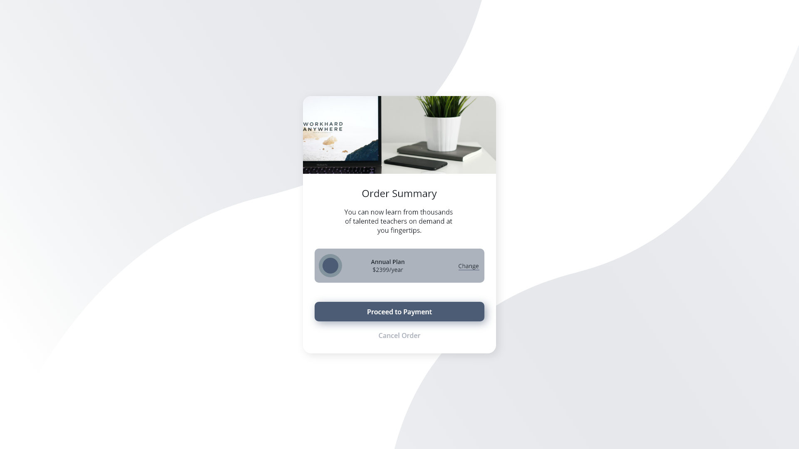

# Techover - Beställnings Kort.

## Anpassa ett Beställningskort

### Uppgiften

Ditt mål är att anpassa och utöka ett Beställningskort så att det efterliknar designen så nära som möjligt. ✨ Beställningskortet har olika “aktive states” som du behöver designa för, exempelvis hover-effekter.

### Verktyg

Använd dina föredragna verktyg, som VS Code, HTML och CSS. Du kan även utmana dig själv genom att prova verktyg som Tailwind eller React om du vill.

### Kom igång

1. **Ladda ner källkoden** från länken och följ instruktionerna i README.md-filen för att komma igång.

2. **Utforska designmappen**: Här hittar du information om "active states", vilket visar hur knappar eller element ändrar utseendet vid interaktion, exempelvis när du hovrar över dem. 😊

3. **Följ style-guide.md**: Instruktionerna i style-guide.md hjälper dig att återspegla designen så noggrant som möjligt. Observera att om din inlämning avviker från style-guide.md kan den bli nekad.

### Inlämning

Du ska lämna in hela projektmappen i .zip-format. Följ dessa steg för att lämna in din uppgift:

1. **Packa ihop projektet**:

   - Öppna projektet i “File Explorer” eller “Finder” (beroende på ditt operativsystem).
   - Högerklicka på projektmappen.
   - Välj “Skicka till” eller “Komprimera” (beroende på ditt operativsystem).
   - Detta skapar en ZIP-fil med ditt projekt.

2. **Ladda upp ZIP-filen** genom att klicka på knappen nedan.

### Tips

- Följ steg-för-steg-instruktionerna i README.md för en smidig process.
- Om du vill utforska nya verktyg som Tailwind eller React är detta en bra möjlighet.
- Se till att dina skärmdumpar återspeglar din anpassning så nära originaldesignen som möjligt.
- En väldesignad inlämning kan vara en bra tillägg till din portfolio.
